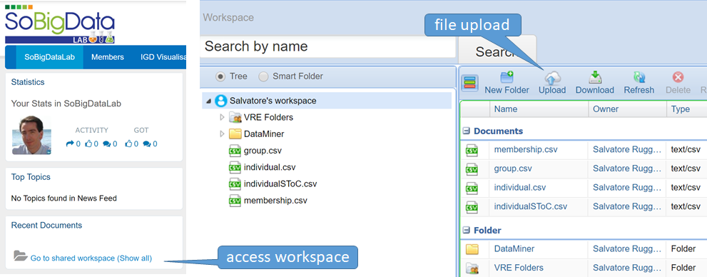

# SCube: A Tool for Segregation Discovery
**Alessandro Baroni** and **Salvatore Ruggieri**    
Department of Computer Science, University of Pisa, Italy  
baroni@di.unipi.it, ruggieri@di.unipi.i

The term segregation refers to the “_separation of socially denied groups_" [[1]](#references). People are partitioned into two or more groups on the grounds of personal or cultural traits that can foster discrimination, such as gender, age, ethnicity, income, skin color, language, religion, political opinion, membership of a national minority, etc. Contact, communication, or interaction among groups are limited by their physical, working or socio-economic distance. Members of a group tend to cluster together when dissecting the society into organizational units (neighborhoods, schools, job types). In [[2]](#references), we proposed a data-driven approach to search for (the “discovery") apriori-unknown contexts and social groups experiencing high segregation risk. We quantify such a risk through a reference segregation index, and assume that a value of the index above a given threshold denotes a situation worth for further scrutiny. We provide in [[2]](#references) a solution to the segregation discovery problem based on an analytical process that relies on frequent pattern mining. The approach is challenged in a complex scenario, which targets segregation of minority groups (youngsters, seniors, females) in the boards of companies. For instance, a social segregation question we are able to study is: _which minority groups are segregated in the boards of companies and for which type of companies?_ The approach is implemented in the SCube system, which is described in detail in [[3, 4]](#references). 

The SCube system comes with Java APIs with a class with main for every module of the system. Moreover, there are two user interfaces:
- The first one is a [standalone wizard](#standalone-wizard-gui) that guides the user throughout all the steps of the analytical process, asking for inputs and parameters when appropriate, and finish launching Microsoft Excel or Libre Office on the output file. 
- The second one is a [cloud service](#sobigdata-gui) offered by the SoBigData research infrastructure, a web front-end comprising a catalogue of data, services, and virtual research environments for big data and social mining research.

## A primer on segregation indexes: the dissimilarity index D

A segregation index provides a quantitative measure of the degree of segregation of social groups (e.g., Blacks and Whites) among units of social organization (e.g., schools). Many indexes have been proposed in the social science literature. We restrict ourselves to binary indexes, which assume a partitioning of people into two groups, say majority and minority. Let **T** be size of the total population, **M** be the size of the minority group, and **P = M/T** be the overall fraction of the minority group. Assume that there are **n** organizational units (or simply, units), and that for i in [1, n], **ti** is the population in unit i, **mi** is the minority population in unit i, and **pi = mi/ti** is the fraction of the minority group in unit i. Evenness indexes measure the difference in the distributions of social groups among the units. The **dissimilarity index D** is the weighted mean absolute deviation of every unit's minority proportion from the global minority proportion:

The normalization factor _2P(1-P)_ is to obtain an index in the range [0, 1]. Since **D** measures dispersion of minorities over the units, higher values of the index mean higher segregation. Dissimilarity is minimum when for all i  [1; n], pi = P, namely the distribution of the minority group is uniform over units. It is maximum when for all i in [1, n], either **pi** = 1 or **pi** = 0, namely every unit includes members of only one group (complete segregation). Other evenness indexes include entropy, and Gini. These three and some further indexes (Atkinson, Isolation, Interaction) are also covered by the SCube software (see [[2-4]](#references) for details). The parameters **A** and **B** of the formula _D(**A**, **B**)_ are itemsets specifying what follows:

- **B** is the reference population, whose total size is **T**; e.g., **B** equal to residence=Tuscany could be interpreted that only individuals from Tuscany are considered in the index. Attributes that can be used for specifying the reference population are called **context attributes (CA)**.
- **A** is the reference minority group, whose total size is **M**; e.g., **A** equal to gender=F could be interpreted that women are the minority group under segregation analysis. Attributes that can be used for specifying the minority group are called **segregation attributes (SA)**.

In the analysis of segregation in the network of boards of directors, the starting point is the graph of companies linked by shared directors. Notice that in such a graph, there is no a-priori defined division of nodes into organizational units. The graph has then to be split into connected components, and, for the Giant component, it is further split by removing edges that connect companies with less than a given number of shared directors. The resulting connected components represent the set of units in the calculation of the dissimilarity index (the __n__ in the formula above). Other clustering approach are also supported by SCube.

## Input Files

The main inputs of SCube are three CSV files with header that specify information about individuals (or directors), about groups (or companies), and about membership of individuals to groups (i.e., directors to the board of a company). The type of attributes in CSV files is assumed to be discrete. Numeric attributes (e.g., age) must be discretized (e.g., into age-ranges such as “0-20, 21-30, …”) beforehand. Segregation (SA) and context attributes (CA) can be multi-valued. For instance, tge attribute “sector” for the company industry sector can have single values, such as “Software”, or multiple values separated by semi-comma, such as “Restaurant;Hotel”. Sample input files are distributed with SCube. In detail:

- **individualFilePath** (or **directors**): is a CSV file with a line for each individual (or director). Columns include: directorID (an integer), a number of SA segregation attributes (e.g., gender, age, etc.), and a number of CA context attributes about the director (e.g., residence, education, etc.). In the example files, there are 2 SA attributes: age and sex.
- **groupFilePath** (or **company**): is a CSV file with a line for each company. Columns include: companyID (an integer), and a number of context attributes CA about the company (e.g., industry sector, number of employees, etc.). In the example files, there are 2 CA attributes: County and Activities. Activities is a multi-valued attribute with statistical codes of economy activity of the company (something close to NACE code).
- **membershipFilePath** (or **bods**): a CSV file with a line for every individual beloning to a group in a certain time interval and for a given role. Columns include: directorID (an integer), companyID (an integer), startDate (a date in the format YYYY-MM-DD), endDate (a date in the format YYYY-MM-DD), and a context attribute (CA) denoting the role (e.g., member, CEO, etc.) In the example files, such columns describe directors belonging to the boards of companies in a given time period and with a given role.

The number and the name of segregation (SA) and context attributes (CA) is not fixed apriori. They are retrieved from the input files above.

## Input Parameters

SCube accepts the following parameters:
- **atkinsonParameter**: the Atkinson segregation index is parametric to a value in the range (0,1). Such a value can be specified with this option. 
- **clusteringAlgorithm** (default is “filterEdgeGCForWeight”): the algorithm used to cluster groups (companies) on the basis of shared individuals (directors). Possible values:
  - “WCCS”: weakly connected components.
  - “filterEdgeGCForWeight”: filter out edges from Giant Component with weight lower or equal than **edgeWeight**, then WCCs.
  - “filterEdges”:  filter edges from whole graph, then WCCs.
  - “removeGiantComponent”: remove whole Giant Component.
  - “stoc”: STOC algorithm from [[5]](#references).
- **date**: the comma-separated list of date snapshots (in the format YYYY-MM-DD) at which to compute segregation indexes. For example: 2013-01-01, 2014-01-01.
- **edgeWeight** threshold (optional, default is “3”): this is used to remove edges of weight lower or equal than the threshold from the Giant Component of the graph of companies connected by shared directors (see “filterEdgeGCForWeight” **clusteringAlgorithm**). 
- **folderOutput**: the directory containing the intermediate processed files, and the final output.
- **minimumSupport** (default is “500”): this is the minimum number for the total minority population, i.e., **M** &#8805; 500 (or the passed value) is a constraint that restricts the set of indexes computed.
- **moduleSegregationCA** (or **SA attributes**): the comma-separated list of segregation attributes in the directors input. For instance, “age,sex”. All remaining attributes of directors will be considered context attributes (CA attributes).
- **moduleSegregationIGNORE**: the comma-separated list of attributes in any of the input files to be ignored in the segregation analysis.
- **weighIsolateNode** (default is “true”): this parameter includes or excludes from the analysis companies that share no directory with any other company (“isolated”).

Parameters used by Java API's classes are set in the option file “varDefs.props”. 

## Output Pivot-Table

SCube provides in output a Microsoft Excel file such as the following:

Here age and sex are segregation attributes (SA) of directors, County and Activities are context attributes (CA) of companies, and timeUnit is the time snapshot a row refers to. Basically, age and sex determine A, the minority population under analysis, County and Activities determine B, the reference total population, and timeUnit fix the time snapshot at which analysis refers to.  For instance, the third row considers how segregated are female irrespective of the age whose company is in the Hiiumaa county irrespective of the company activity sector. For each minority population A and reference population B, the remaining columns report:
- **M**, the size of the minority population.
- **T**, the size of the reference population.
The value of several segregation indexes: the dissimilarity index _D(**A**, **B**)_,  Entropy , Gini Isolation, Interaction, and Atkinson.

Multidimensional analysis of the output can be performed within Excel by building a Pivot Table and/or Pivot charts. This is part of post-processing of the output, and it depends on the input segregation and context attributes. An example use of Pivot charts is the following figure, which reports the value of dissimilarity index for female directors, at the variation of the industry sector of the company groups they belong in the board of. 

The index is shown for population of directors living in the area of Harjumaa and in the whole Estonian country (label “blank”). The radar plot shows how Harjumaa has lower segregation than the whole country for almost all industry sectors. Note, however, that data is a sample and results cannot be stated in general. 

## Standalone Wizard GUI

SCube includes a standalone Graphical User Interface (GUI) to launch the system without any programming expertise. The GUI allow the user to set the input files and the 5 parameters described above. **The standalone GUI has been tested on Windows OS only.** A screenshot of the GUI is provided next.

After setting input directory, files, use of isolated nodes, and CA-attributes, the user can start the computation. The GUI will ask for the clustering algorithm to use. Leave the default one, which use connected components after removing from the giant component links between companies that share a number of directors in their boards lower or equal than a minimum threshold.

The GUI will ask for the minimum edge-weight theshold. In [[2-3]](#references), we experimented with 3, but this number can be set by the user. The GUI shows the full range of possible number of shared directors.

Next the GUI will ask for the minimum support threshold, so that only cases with **M** (size of the minority population) greater or equal than the threshold will be considered. The GUI will show the range of possible values of such a threshold. In [[2-3]](#references), we experimented with 500, but this number can be set by the user.

This is the last parameter needed. The computation will continue, and a log of the progress will be shown in the console panel. 

The final step is to launch the default .xls viewer to navigate the results. The results of the last computation can be opened without having to recomputed all the step by clicking on the button “View Result” of the GUI, or, alternatively, by opening the s-cube.xls file in the input file directory.

## SoBigData GUI

A GUI in the cloud can be accessed from the SoBigData research infrastructure (http://www.sobigdata.eu/access/virtual), after registration (for free!).

Locate the SCube method in SoBigDataLab as follows.

SCube inputs and parameters can be set online.

In particular, input files must be located in the SoBigData workspace, which can be accessed as shown next.

Multidimensional analysis of the output can be performed within Excel by building a Pivot Table and/or Pivot charts. 

## References

[1] D. S. Massey. Segregation and the perpetuation of disadvantage. The Oxford Handbook of the Social Science of Poverty, page 369, 2016.

[2] A. Baroni, S. Ruggieri.  [Segregation Discovery in a Social Network of Companies](http://pages.di.unipi.it/ruggieri/Papers/jiis.pdf). J. of Intelligent Information Systems 51(1): 71-96, August 2018.

[3] A. Baroni.  [Segregation-aware data mining](https://etd.adm.unipi.it/theses/available/etd-10122017-195900/). PhD thesis. Dipartimento di Informatica, Università di Pisa. October 2017.  

[4] A. Baroni, S. Ruggieri. [SCube: A Tool for Segregation Discovery](http://openproceedings.org/2019/conf/edbt/EDBT19_paper_212.pdf). 22nd International Conference on Extending Database Technology (EDBT 2019): 542-545. OpenProceedings.org, March 2019.

[5] A. Baroni, A. Conte, M. Patrignani, S. Ruggieri. [Efficiently Clustering Very Large Attributed Graphs](https://arxiv.org/abs/1703.08590). IEEE/ACM International Conference on Advances in Social Networks Analysis and Mining (ASONAM 2017) 369-376. ACM, August 2017.
